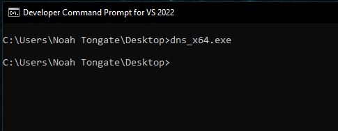

# DNS-Info-Beacon
This simple payload can be used for offensive operations as a proof of execution on a victims machine.

## Usage

*Before Compiling:* Modify the defined values `DNSSRV` and the `DOMAIN` value at the top of the `main.cpp` file to configure the payload for your situation.

- **DNSSRV**: The DNS server IP
- **DOMAIN**: The domain to be queried

### Example
After compiling the payload and the DNS server has been started the payload can be sent to a victim via whatever phishing method and reqested to execute the binary. When the victim runs the binary it will get the computer name and username of the victim who executed the payload and prepend to the beginning of the domain of your choosing. A DNS request will be made to the DNS server IP set in the defined value of main.cpp.

1) Executing the binary on Windows 10 x64 victim machine

2) The following is a screen shot of the victim system information to prove the values retrived in the next screen shot match.

3) A DNS query was logged with a date and time along with the request type and reply that was sent to the victim. This data can be appeneded to a file and grepped for victims who have executed the binary.

## Credits
- DNS Server Code Duplicated from [zoreu/ddnsserver.py](https://gist.github.com/zoreu/a794ed65d67ba322aef5f13cc146f5c9)
- Referenced sample code from [ microsoft/Windows-classic-samples](https://github.com/microsoft/Windows-classic-samples)